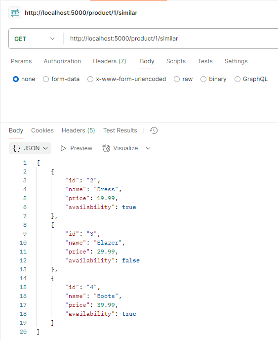
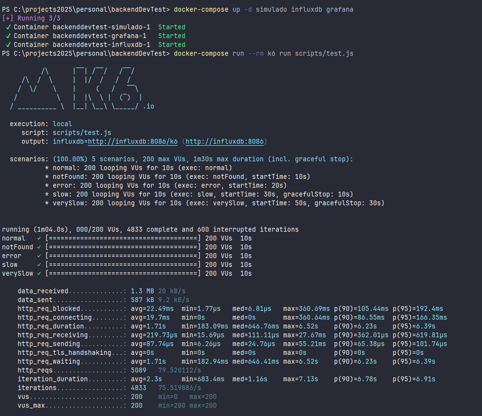
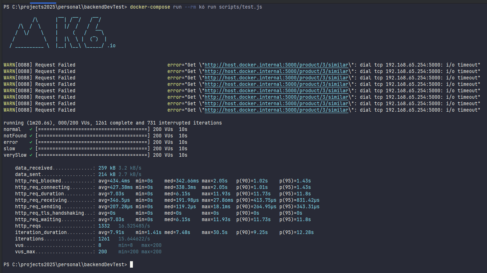

# Backend Dev Test - Product Service

Este proyecto implementa un servicio backend en Java usando Spring Boot. Expone un endpoint REST que permite obtener los productos similares a uno dado, gestionando adecuadamente los errores, los fallos de red y manteniendo una arquitectura limpia y mantenible.
## Tecnologías

- Java 17
- Spring Boot
- Spring WebFlux (con WebClient)
- Lombok
- Docker & Docker Compose
- K6 (testing de carga)

---

## Cómo arrancar el servicio

1. **Build del proyecto**:

   ```bash
   ./gradlew build

## Arquitectura

El servicio sigue una estructura clara basada en capas:

- `domain`: Modelo del dominio
- `application`: Lógica de negocio (ProductService)
- `infrastructure`: Cliente WebClient externo (ProductClient)
- `controller`: Exposición del endpoint
- `config`: Configuración general (WebClient + excepciones)

## Resiliencia implementada

- **Timeout** de 5 segundos en llamadas externas (configurado en `WebClient`)
- **Retry** automático (1 intento adicional en caso de fallo puntual)
- **Fallback** seguro ante errores del proveedor externo
- **Logging** centralizado en errores

## Endpoints implementados

Devuelve la lista de productos similares a un producto determinado.

    GET /product/{productId}/similar



## Manejo de errores

La aplicación gestiona los siguientes errores con códigos y mensajes adecuados:

    Código	    Motivo	                Descripción
    404	    ProductNotFoundException	Producto no encontrado
    400	    ClientRequestException	Error en la petición al servicio externo
    500	    General Exception	        Error inesperado en el servidor

## Configuración WebClient

El cliente HTTP (WebClient) está configurado con timeout para evitar bloqueos y mejorar la resiliencia del sistema. Las excepciones se gestionan globalmente

## Pruebas de rendimiento (K6)





